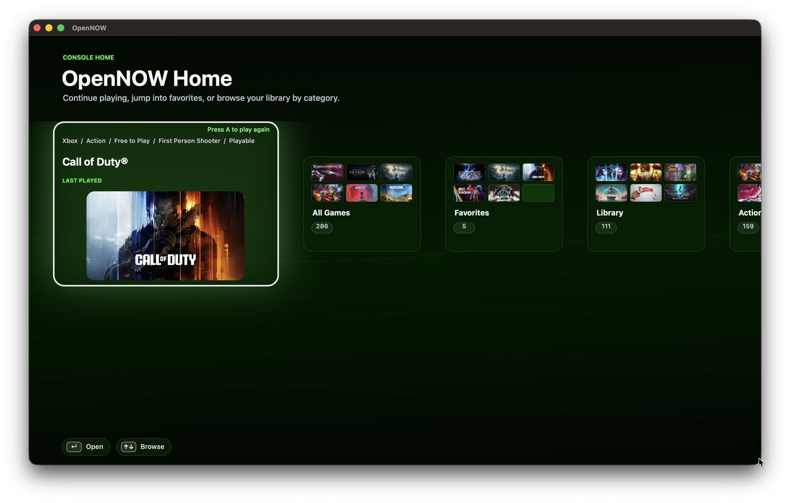

# OpenNOW

OpenNOW is a native macOS cloud gaming client built with AppKit, Objective-C++, and WebRTC. It provides a desktop-first interface for signing in, browsing games, and launching cloud streams.



## Features

- Native AppKit UI with browser-based OAuth sign-in
- Persistent sessions and account switching
- Catalog browsing, library view, and game launch flow
- Native WebRTC streaming with audio/video/input controls
- Stream preferences for region, codec, bitrate, and recovery

## Requirements

- macOS with AppKit/Cocoa support
- `clang++` with C++20 and Objective-C ARC support
- `cmake` for building Sentry Native
- Apple Command Line Tools or Xcode toolchain
- `WebRTC.framework` or `WebRTC.xcframework` in `third_party/webrtc-official`

## Sentry Native

Install the latest Sentry Native release before building with crash reporting enabled:

```sh
scripts/install-sentry-native.sh
```

The installer writes the SDK to `third_party/sentry-native/install`. To send a one-time verification message during launch, run with `OPN_SENTRY_VERIFY=1`.

## Build & Run

```sh
make
make run
```

Build artifacts are written to `build/OpenNOW`.

`make run` enables `OPN_INFO_LOGS=1` by default so runtime logs are printed in the terminal. To watch logs from another terminal while the app is running, use:

```sh
make logs
```

The live log target tails the captured runtime log at `${TMPDIR:-/tmp/}OpenNOW/OpenNOW-current.log`.

## Clean

```sh
make clean
```

## Repository Layout

- `src/main.mm` - app entry point
- `src/OPNAppDelegate.*` - app lifecycle and navigation
- `src/auth/` - OAuth and session handling
- `src/games/` - catalog, library, and launch logic
- `src/streaming/` - WebRTC stream session and UI
- `src/views/` - native AppKit views
- `src/common/` - shared types and helpers
- `assets/` - artwork and icons

## Contributing

Open issues for bugs or feature requests and submit pull requests for improvements.
